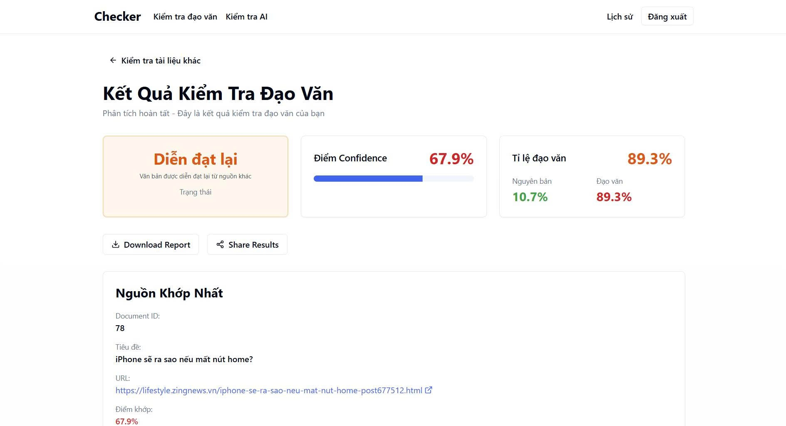
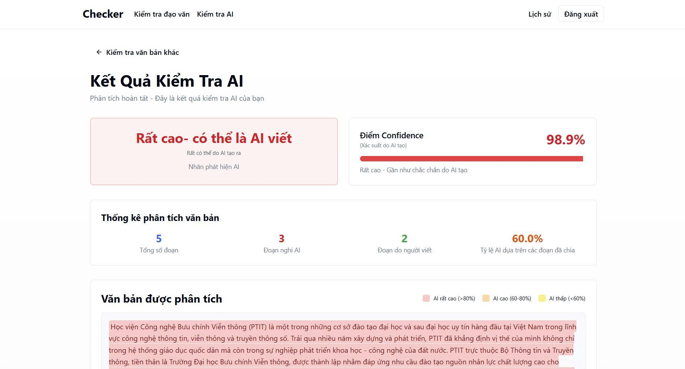

# Plagiarism & AI-Generated Text Detection System

Đồ án xây dựng hệ thống kiểm tra **đạo văn** và **phát hiện văn bản do AI tạo** cho tiếng Việt.

## 1) Tổng quan

Hệ thống gồm 3 dịch vụ backend + 1 frontend:

- **React Frontend**: giao diện nhập văn bản, hiển thị kết quả, lịch sử
- **Flask Plagiarism API** (`backend/api/plagiarism_api.py`): kiểm tra đạo văn theo từng đoạn/câu và tổng hợp theo tài liệu
- **Flask AI Detection API** (`backend/api/ai_detection_api.py`): ước lượng xác suất văn bản do AI tạo + highlight các đoạn nghi ngờ
- **Node.js Auth API** (`backend/node-auth`): đăng ký/đăng nhập JWT, lưu lịch sử/ báo cáo (MongoDB)

## 2) Chức năng chính

- **Kiểm tra đạo văn**: trả về mức độ tương đồng, các đoạn trùng/giống nghĩa, văn bản nguồn tham chiếu
- **Phát hiện AI-generated text**: trả về xác suất AI, nhãn phân loại, và (nếu có) danh sách đoạn được highlight
- **Tài khoản & lịch sử**: đăng ký/đăng nhập, lưu và xem lại các lần kiểm tra

## Demo / Screenshots

### Kết quả kiểm tra đạo văn



### Kết quả kiểm tra AI



## 3) Công nghệ / công cụ đã dùng

### Frontend

- **React** + **react-router-dom**
- **Tailwind CSS** (tailwindcss + postcss + autoprefixer)

### Backend (Python)

- **Flask** + **flask-cors**
- **PyTorch** (`torch`) + **Hugging Face Transformers** (`transformers`)
- **Sentence-Transformers** (`sentence-transformers`) để encode embedding
- **FAISS** (`faiss-cpu`) để tìm kiếm gần đúng/nhanh trên embedding
- **scikit-learn** + **joblib** (combiner logistic regression)
- `regex` để xử lý Unicode tốt hơn

### Backend (Node.js)

- **Express** + **cors** + **morgan**
- **MongoDB** (Mongoose)
- **JWT** (`jsonwebtoken`) + **bcrypt** (hash mật khẩu)
- **dotenv**

### Model / dữ liệu 

- PhoBERT (VinAI) và các model fine-tuned (local trong `backend/model/`)
- Index/embeddings và các file dữ liệu phục vụ truy hồi (local trong `backend/data/`)

## 4) Mô hình học sâu & pipeline xử lý


### 4.1) Plagiarism Detection 


- **Tách câu / chia đoạn (chunking)**: đầu vào được chuẩn hoá và tách câu, sau đó ghép/tách để tạo các “đơn vị so khớp”.
- **Embedding semantic (Deep Learning)**:
  - Dùng **Sentence-Transformers** với model `bkai-foundation-models/vietnamese-bi-encoder` để encode các câu/đoạn thành vector embedding.
  - Embedding được **chuẩn hoá** và so khớp bằng **dot-product/cosine**.
- **Truy hồi nhanh trên kho corpus**:
  - Dùng embedding đã được tính sẵn trong `backend/data/chunk_embeddings_normalized.npy`.
  - Dùng **FAISS index** `backend/data/chunk_faiss_index.faiss` (khi có) để tăng tốc tìm top-k ứng viên.
- **Chấm điểm & tổng hợp**:
  - Kết hợp tín hiệu semantic similarity + các đặc trưng heuristic (lexical overlap, thứ tự câu, độ liên tiếp, …) để ra điểm cuối.
- **Kiểm tra paraphrase bằng PhoBERT fine-tuned**:
  - Với các cặp nghi ngờ “diễn đạt lại”, hệ thống có thể dùng **PhoBERT fine-tuned dạng sequence classification** (local) để xác nhận paraphrase.
  - Model mặc định được tìm trong `backend/model/phobert_finetuned/` (hoặc set biến môi trường `PHOBERT_PARAPHRASE_MODEL_DIR`).

### 4.2) AI-Generated Text Detection (Flask)


- **Classifier PhoBERT fine-tuned (Deep Learning)**:
  - Load model phân loại từ thư mục local `backend/model/detector_phobert/` bằng **Transformers + PyTorch**.
  - Trả về xác suất AI cho từng cửa sổ (window) và tổng hợp theo văn bản.
- **Pseudo-Perplexity bằng MaskedLM (Deep Learning)**:
  - Dùng `vinai/phobert-base` dạng **Masked Language Model** để tính pseudo-perplexity như một feature bổ sung.
- **Combiner (Machine Learning)**:
  - Load `backend/data/combiner_logreg.joblib` để kết hợp nhiều feature (xác suất classifier, pseudo-ppl, thống kê độ dài/đặc trưng văn bản, …) thành `combined_prob_ai`.
- **Highlight đoạn nghi ngờ AI**:
  - Tách câu/đoạn và chạy dự đoán để trả về `highlighted_segments` (nếu khởi tạo được), giúp UI tô màu đoạn nghi ngờ.

### 4.3) Notebook / tài liệu thực nghiệm

- `backend/notebooks/Plagiarism_check_final.ipynb`: logic tham chiếu cho plagiarism pipeline
- `backend/notebooks/Check_AI.ipynb`: logic tham chiếu cho AI detection pipeline

## 5) Chuẩn bị dữ liệu & model

Repo đã cấu hình `.gitignore` để **không commit** các thư mục lớn `backend/data/` và `backend/model/`.
Vì vậy trước khi chạy, bạn cần tải 2 thư mục này về máy.

- Google Drive: https://drive.google.com/drive/u/0/folders/13l2pWqHqDA5zh8Zk_2Lfy4Z4ONfj-OWm

Sau khi tải/giải nén, đảm bảo cấu trúc như sau:

```
backend/
  data/        # embeddings, faiss index, joblib...
  model/       # detector_phobert, phobert_finetuned...
```

## 6) Cài đặt & chạy

Hướng dẫn chi tiết: [SETUP_GUIDE.md](SETUP_GUIDE.md)

### Chạy nhanh

- Windows: chạy `start.bat`
- Linux/macOS: chạy `./start.sh`

### Chạy thủ công (tóm tắt)

1) Python APIs

```bash
cd backend/api
pip install -r requirements.txt
python plagiarism_api.py
python ai_detection_api.py
```

2) Node Auth API

```bash
cd backend/node-auth
npm install
npm start
```

3) React Frontend

```bash
cd frontend
npm install
npm start
```

## 7) API endpoints

### Plagiarism API (mặc định port 5000)

- `GET /api/health`
- `POST /api/check-plagiarism`  (body: `{ "text": "..." }`)

### AI Detection API (mặc định port 5002)

- `GET /api/health`
- `POST /api/check-ai` (body: `{ "text": "..." }`)

### Node Auth API (mặc định port 5001)

- `GET /health`
- `/api/auth/*`, `/api/history/*`, `/api/ai-check/*`

## 8) Biến môi trường (tuỳ chọn)

- `PHOBERT_PARAPHRASE_MODEL_DIR`: trỏ tới thư mục model PhoBERT paraphrase (nếu bạn đặt ngoài `backend/model/`).
- `AI_PORT`: đổi port AI Detection API (mặc định 5002).
- `PORT`, `MONGO_URI`, `JWT_SECRET`, `CORS_ORIGIN`: cấu hình cho Node Auth API (xem `backend/node-auth/.env`).

